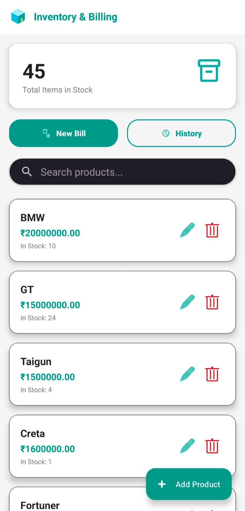
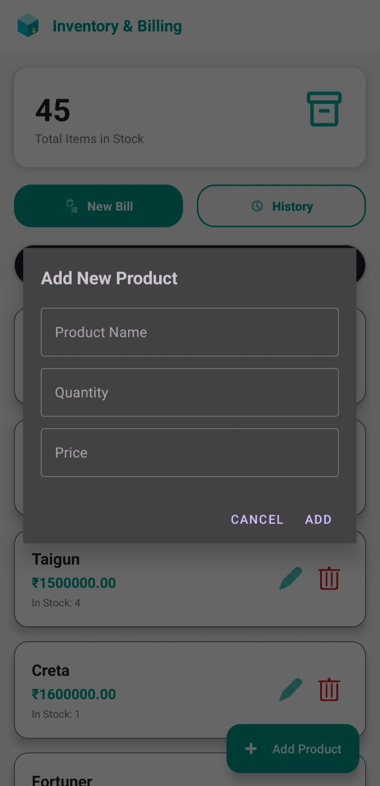
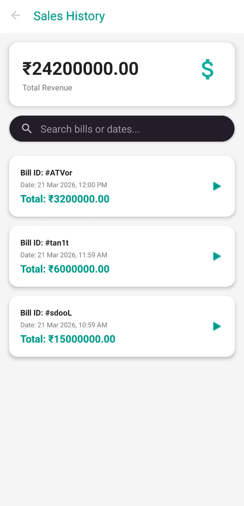
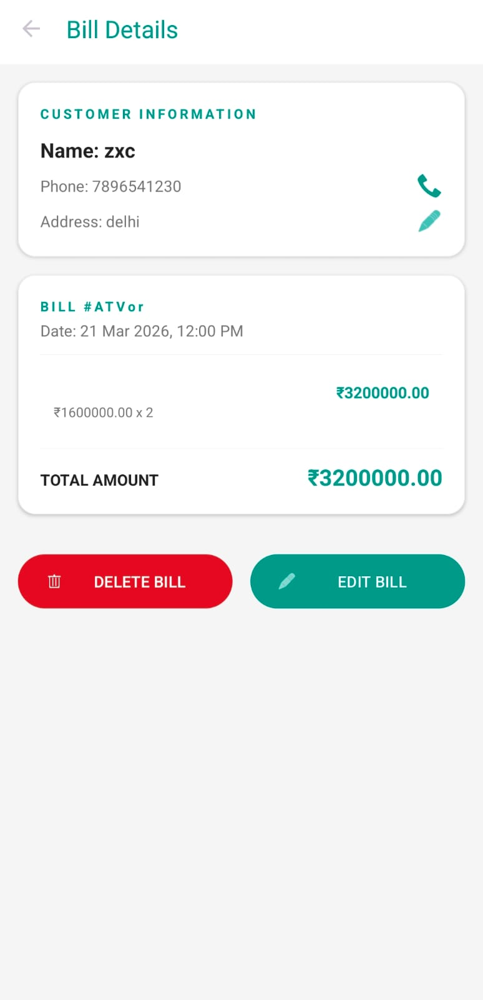

# 📦 Inventory App (Firebase)

A modern Android Inventory Management App built using Java and Firebase.

---

## 🚀 Features

- Firebase Authentication
- Add / Update / Delete Products
- Realtime Database
- Clean UI

---

## 📸 Screenshots

---

## 🛠 Tech Stack

- Java
- Firebase
- XML

---
## 📂 Project Structure

MainActivity → Home Screen
AddProductActivity → Add Products
BillActivity → Calculate Total

---

▶️ How to Run

Clone this repo
Open in Android Studio
Add your own google-services.json file
Run the app

---

## 👨‍💻 Developer

Vraj Vaishnav
